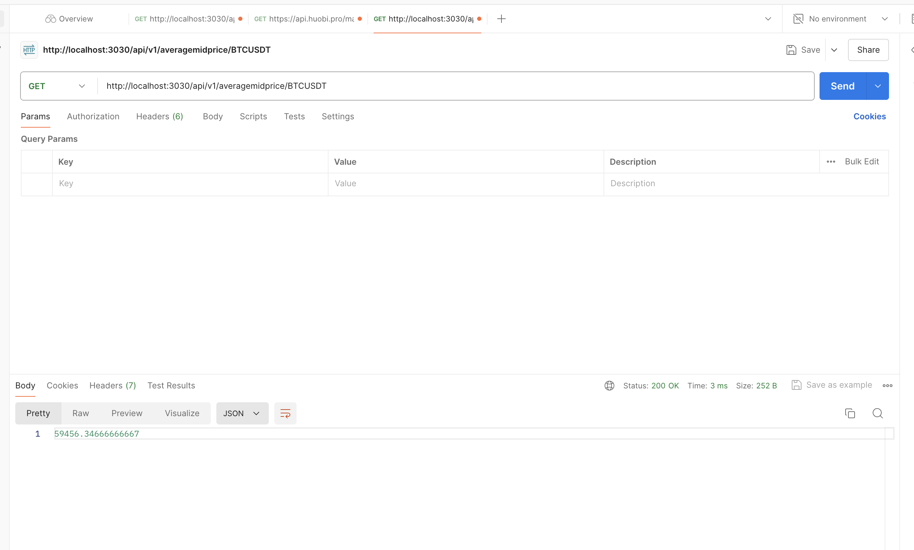
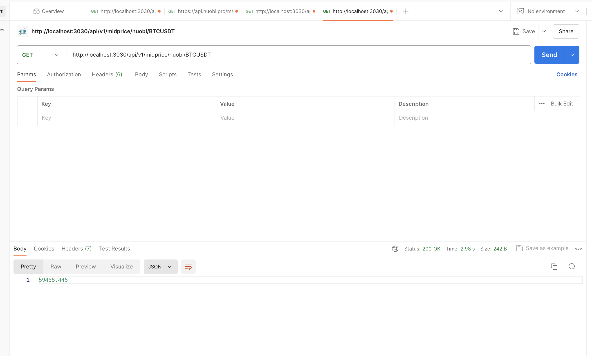

# Welcome to the project which exposes the orderbook data from Binance, Kraken and Huobi


The project is composed of several components
- #### "orderbook" is responsible for initializing, storing the data of orderbooks coming from different sources.
- #### "socket" is responsible for connecting to the ws channels of designated data source and updating the ask & bid data stored in the orderbook
- #### prototypes define the necessary data types for the API.
- #### "utils" is in charge of logging and providing algebraic functions.
 
### The data of Binance and Kraken are updated by websocket protocol. You can choose expected symbol like "BTCUSTD" in the API interface

Orderbook data fetched are stored in src/price_data and are regularly updated. Best Bid, Best Ask and mid price are stored in a file named "mid_price.json" as a triplet. Data of different symbol types like "BTCUSTD" or "ETHUSTD" will be stored in different repositories.

## To launch the app:

```
npm install
npm run start:dev
```

## Test results:

### Average mid price of BTCUSTD:



### Mid price from Binance:


### Mid price from Kraken:


### Mid price from Huobi:
